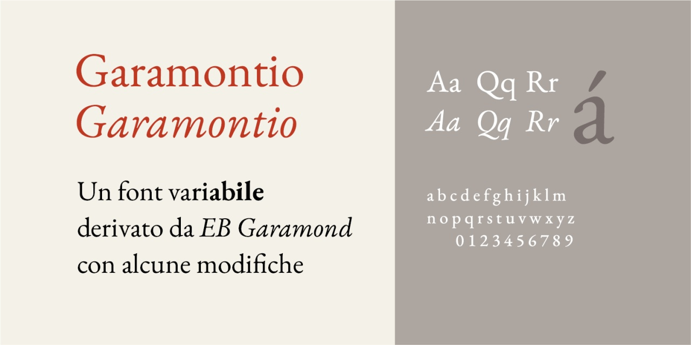
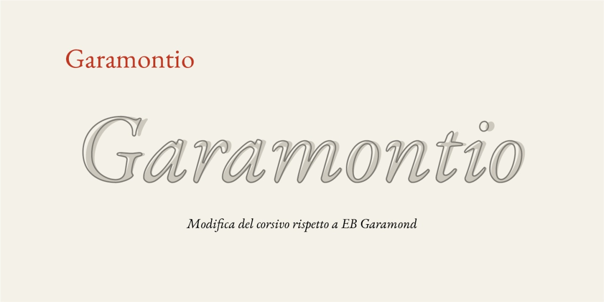
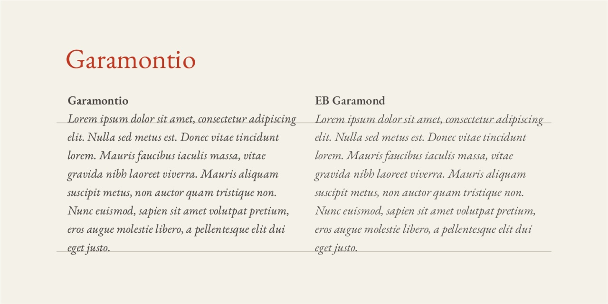
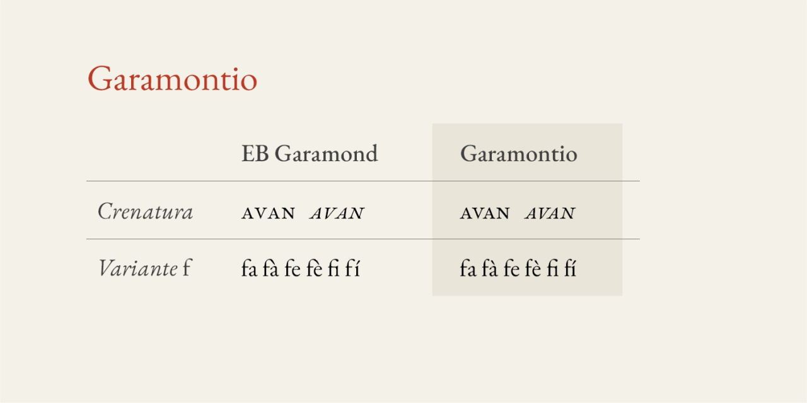
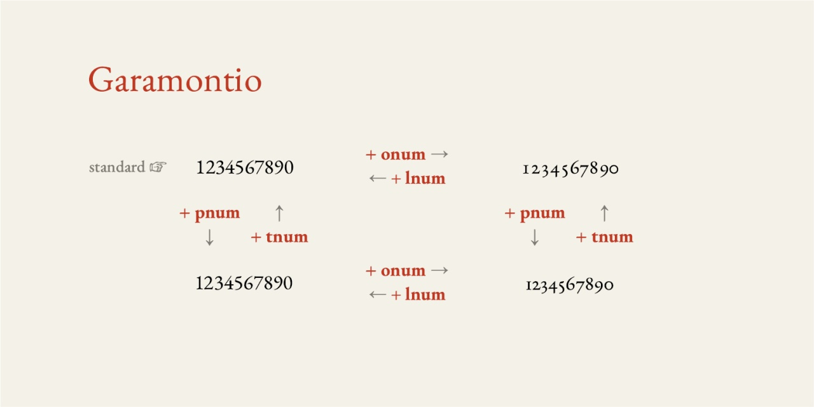
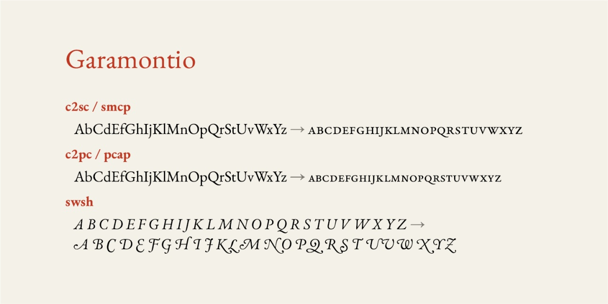
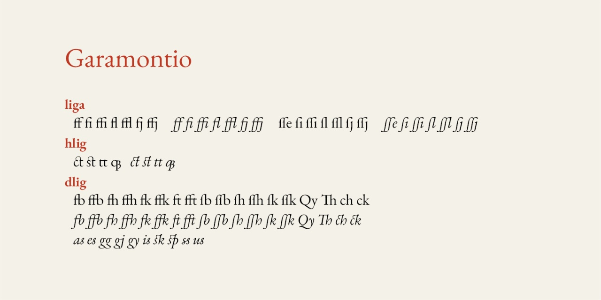
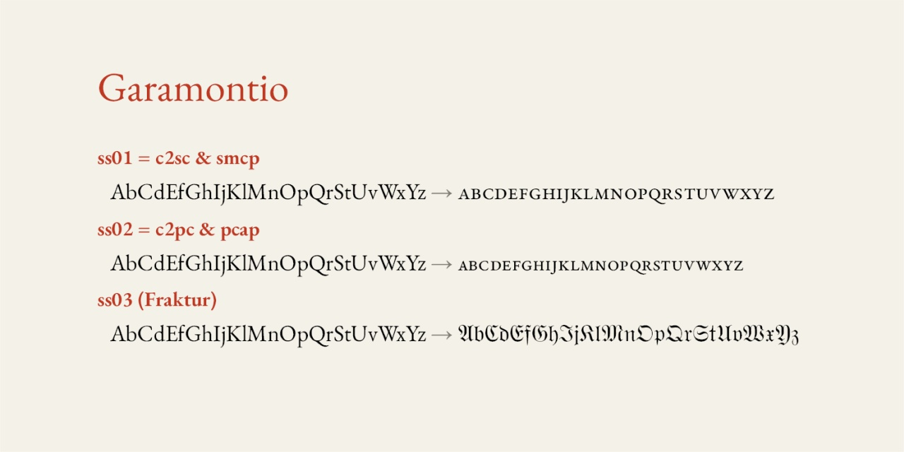
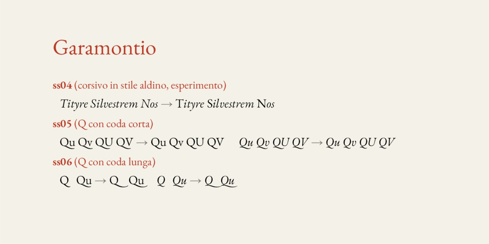
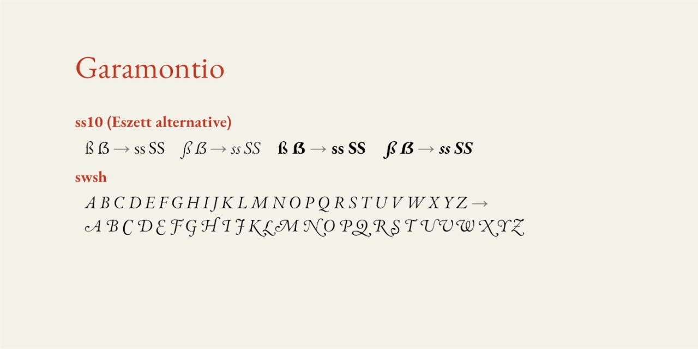

# Garamontio

Per testare il font, vedere la [pagina interattiva](https://m-casanova.github.io/Garamontio/).

Il font è distribuito in formato WOFF2 e TTF; è rilasciato con licenza OFL 1.1.

## Stylistic Sets 01-20
Sono disponibili le seguenti caratteristiche opentype:
* __ss01__ = __smcp&c2sc__ : maiuscoletto completo (maiuscole e minuscole)
* __ss02__ = __pcap&c2pc__ : maiuscoletto minore (maiuscole e minuscole)
* __ss03__ : versione alternativa delle lettere greche per IPA
* __ss04__ : posizione alternativa degli accenti per le lettere /b /d /h /k
* __ss05__ : Q con coda corta
* __ss06__ : Q con coda lunga
* __ss07__ : utilizza la lettera [s lunga](https://it.wikipedia.org/wiki/S_lunga) __ſ__
* __ss08__ : utilizza la lettera s lunga, ma non con doppia s lunga
* __ss09__ = __ornm__ : elementi ornamentali disegnati sulla base dell'[esemplare disponibile online](https://sammlungen.ub.uni-frankfurt.de/drucke/content/zoom/7499396)
* __ss10__ : versione alternativa (SS/ss) per __ẞ__ e __ß__

Le caratteristiche opentype sono facilmente attivabili in LibreOffice ([it](https://help.libreoffice.org/latest/it/text/shared/01/font_features.html) / [en](https://help.libreoffice.org/latest/en-US/text/shared/01/font_features.html))

## Descrizione
_Garamontio_ è derivato da _[EB Garamond](https://github.com/octaviopardo/EBGaramond12)_ di Octavio Pardo; il font deriva a sua volta dal font _[EB Garamond](https://github.com/georgd/EB-Garamond)_ di Georg Mayr-Duffner.

Rispetto a EB Garamond sono state effettuate alcune modifiche. Principalmente è stato modificato il corsivo e sono state fatte modifiche agli operatori matematici.

Esempi di alcune caratteristiche opentype:

## Versioni
- Versione 0.951: fix minori + aggiunta caratteri + modifica ss10
- Versione 0.950: fix minori + aggiunta caratteri + prima crenatura per pcap&c2pc
- Versione 0.949: fix minori, incluse alcune ancore per alfabeto cirillico
- Versione 0.948: fix minori + ss09 (elementi ornamentali)
- Versione 0.947: fix minori + ss05 (Q coda corta) + ss06 (Q coda lunga) + ss08 (eszet)
- Versione 0.946: aggiunta /copyleft + test per ss06 (coda lettera Q)
- Versione 0.944: fix accenti + longs
- Versione 0.943: fix minori (dlig e crenatura)
- Versione 0.942: aggiunta caratteri pcap
- Versione 0.941: fix minori + test ss04 (varianti /b /d /h /k)
- Versione 0.940: aggiunta di caratteri per cedilla + test ss04 (varianti /h e /k)
- Versione 0.939: aggiunta di caratteri + fix minori
- Versione 0.938: blocco IPA completato + carattere ℗ + fix minori
- Versione 0.937: aggiunta di caratteri e fix minori
- Versione 0.935: sistemazione di caratteri combinati
- Versione 0.934: tentativo di sistemazione delle ancore per i caratteri combinati
- Versione 0.933: aggiunti caratteri musicali, SS03 (caratteri greci IPA + corsivo), fix kerning / con punteggiatura
- Versione 0.932: blocco IPA (aggiunte caratteri) e sistemazione per alcuni segni diatrici
- Versione 0.931: blocco IPA (aggiunte caratteri) e sistemazione per alcuni segni diatrici
- Versione 0.929: blocco IPA (aggiunte e correzione forma di alcuni caratteri), correzione ę
- Versione 0.928: blocco IPA (aggiunte e correzione forma di alcuni caratteri)
- Versione 0.927: blocco IPA (aggiunte)
- Versione 0.926: fix per caratteri combinati (continuazione)
- Versione 0.925: fix per caratteri combinati (non ancora completato)
- Versione 0.924: fix minori
- Versione 0.923: fix minore e aggiunta carattere F160 da MUFI
- Versione 0.922: tentativo di sistemazione di f.short per alcuni casi
- Versione 0.921: sistemazione problemi di interpolazione di alcuni caratteri (regular + italic)
- Versione 0.919: sistemazione disegno dei caratteri
- Versione 0.918: sistemazione della crenatura per diversi caratteri
- Versione 0.917: sistemazione _dlig_ e alcuni fix ai caratteri
- Versione 0.916: aggiunta di alcuni caratteri per trascrizioni come da progetto [MUFI](https://en.wikipedia.org/wiki/Medieval_Unicode_Font_Initiative)
- Versione 0.915: aggiunta di alcuni caratteri per trascrizioni come da progetto MUFI
- Versione 0.911: fix minori e creazione file per versioni statiche del font (otf, ttf, woff, woff2)
- Versione 0.906: modifiche minime per compatibilità con [Garamontio Sans](https://github.com/m-casanova/GaramontioSans)
- Versione 0.905: fix frazioni
- Versione 0.904: versione di prova con miglioramento delle classi e sistemazione di alcuni riferimenti
