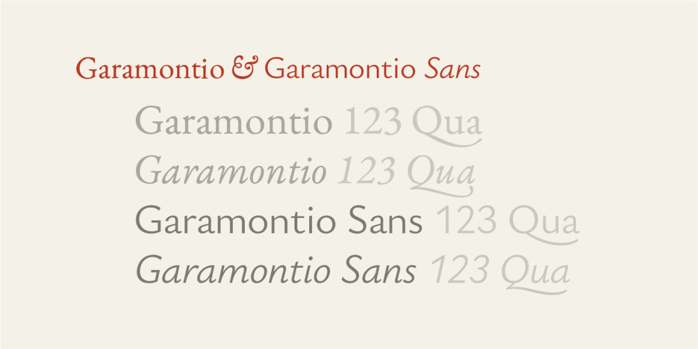
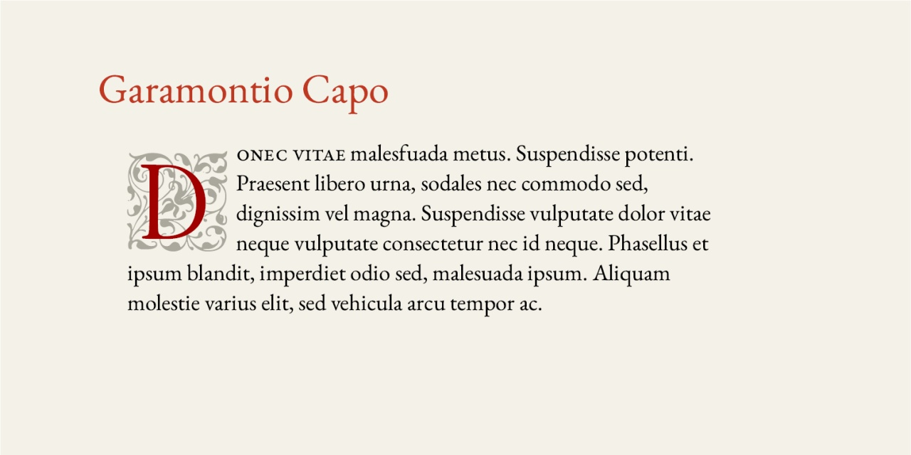

# Garamontio
- Versione 0.939: aggiunta di caratteri + fix minori
- Versione 0.938: blocco IPA completato + carattere ℗ + fix minori
- Versione 0.937: aggiunta di caratteri e fix minori
- Versione 0.935: sistemazione di caratteri combinati
- Versione 0.934: tentativo di sistemazione delle ancore per i caratteri combinati
- Versione 0.933: aggiunti caratteri musicali, SS03 (caratteri greci IPA + corsivo), fix kerning / con punteggiatura
- Versione 0.932: blocco IPA (aggiunte caratteri) e sistemazione per alcuni segni diatrici
- Versione 0.931: blocco IPA (aggiunte caratteri) e sistemazione per alcuni segni diatrici
- Versione 0.929: blocco IPA (aggiunte e correzione forma di alcuni caratteri), correzione ę
- Versione 0.928: blocco IPA (aggiunte e correzione forma di alcuni caratteri)
- Versione 0.927: blocco IPA (aggiunte)
- Versione 0.926: fix per caratteri combinati (continuazione)
- Versione 0.925: fix per caratteri combinati (non ancora completato)
- Versione 0.924: fix minori
- Versione 0.923: fix minore e aggiunta carattere F160 da MUFI
- Versione 0.922: tentativo di sistemazione di f.short per alcuni casi
- Versione 0.921: sistemazione problemi di interpolazione di alcuni caratteri (regular + italic)
- Versione 0.919: sistemazione disegno dei caratteri
- Versione 0.918: sistemazione della crenatura per diversi caratteri
- Versione 0.917: sistemazione _dlig_ e alcuni fix ai caratteri
- Versione 0.916: aggiunta di alcuni caratteri per trascrizioni come da progetto [MUFI](https://en.wikipedia.org/wiki/Medieval_Unicode_Font_Initiative)
- Versione 0.915: aggiunta di alcuni caratteri per trascrizioni come da progetto MUFI
- Versione 0.911: fix minori e creazione file per versioni statiche del font (otf, ttf, woff, woff2)
- Versione 0.906: modifiche minime per compatibilità con [Garamontio Sans](https://github.com/m-casanova/GaramontioSans)
- Versione 0.905: fix frazioni
- Versione 0.904: versione di prova con miglioramento delle classi e sistemazione di alcuni riferimenti

Per maggiori informazioni e per testare il font, vedere la [pagina interattiva](https://m-casanova.github.io/Garamontio/).

## Utilizzo
Il font è distribuito in formato WOFF2 e TTF; è rilasciato con licenza OFL 1.1.

## Descrizione
_Garamontio_ è derivato da _[EB Garamond](https://github.com/octaviopardo/EBGaramond12)_ di Octavio Pardo; il font deriva a sua volta dal font _[EB Garamond](https://github.com/georgd/EB-Garamond)_ di Georg Mayr-Duffner.

Rispetto a EB Garamond sono state effettuate alcune modifiche. Principalmente è stato modificato il corsivo e sono state fatte modifiche agli operatori matematici.

È anche disponibile il capolettera [Garamontio Capo](https://github.com/m-casanova/GaramontioCapo) (a due livelli)

Esempi di alcune caratteristiche opentype:

