# Garamontio

⟶ __[Download](https://github.com/m-casanova/Garamontio/releases)__ (OTF, TTF, WOFF, WOFF2, variable TTF, source)

Per testare il font, vedere la [pagina interattiva](https://m-casanova.github.io/Garamontio/).

Il font è rilasciato con licenza OFL 1.1.

* Font variabile (tondo e corsivo): formati TTF e WOFF2
* Font separati (diversi pesi): formati TTF, WOFF e WOFF2; il formato OTF è sperimentale.

Al momento è preferibile utilizzare il formato TTF, dato con il formato OTF non è stato testato e potrebbe avere problemi.

## Descrizione
_Garamontio_ è derivato da _[EB Garamond](https://github.com/octaviopardo/EBGaramond12)_ di Octavio Pardo, che deriva a sua volta dal font _[EB Garamond](https://github.com/georgd/EB-Garamond)_ di Georg Mayr-Duffner.

Alcuni simboli e operatori matematici sono stati tratti da [Garamond Math](https://github.com/YuanshengZhao/Garamond-Math), con alcune modifiche.

Rispetto a EB Garamond sono state effettuate alcune modifiche. Principalmente è stato modificato il corsivo e sono state fatte modifiche agli operatori matematici.

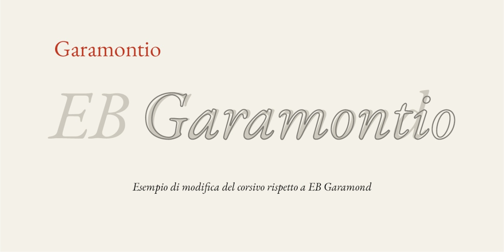

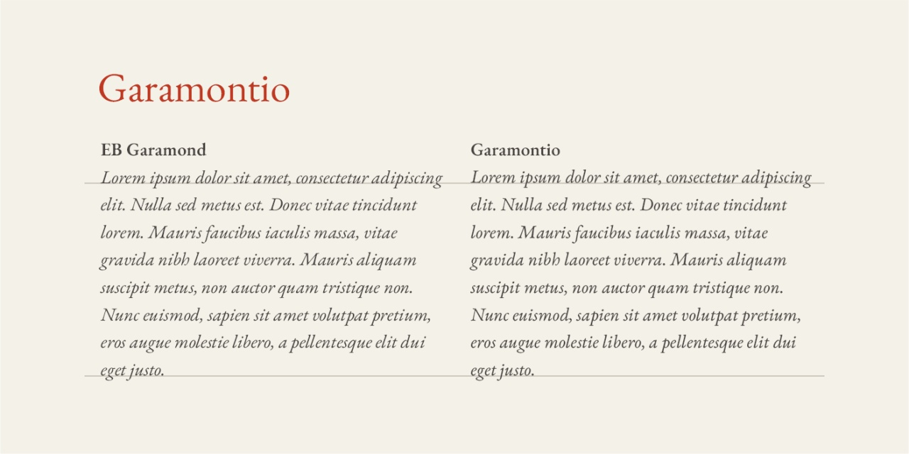

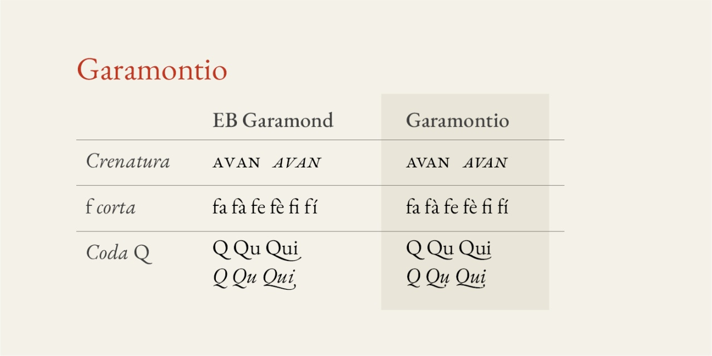

## Opentype

Alcune caratteristiche opentype disponibili:
* __ss01__ = __smcp&c2sc__ : maiuscoletto completo (maiuscole e minuscole)
* __ss02__ = __pcap&c2pc__ : maiuscoletto minore (maiuscole e minuscole)
* __ss03__ : accesso rapido a caratteri fraktur (matematica)
* __ss04__ : maiuscole in tondo selezionando il corsivo (esperimento, solo corsivo)
* __ss05__ : Q con coda corta
* __ss06__ : Q con coda lunga
* __ss07__ : utilizza la lettera [s lunga](https://it.wikipedia.org/wiki/S_lunga) __ſ__
* __ss08__ : utilizza la lettera s lunga, ma non con doppia s lunga
* __ss09__ = __ornm__ : elementi ornamentali disegnati sulla base dell'[esemplare disponibile online](https://sammlungen.ub.uni-frankfurt.de/drucke/content/zoom/7499396)
* __ss10__ : zero alternativo (disponibile anche per __onum__, __pnum__, __smcp__ e __c2sc__)

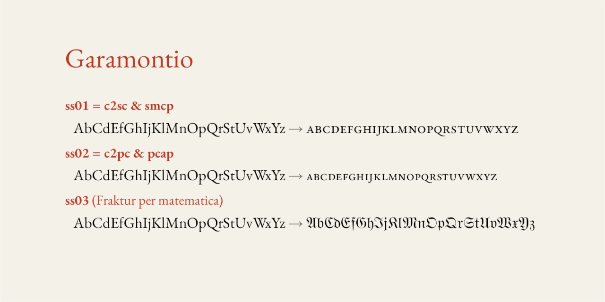

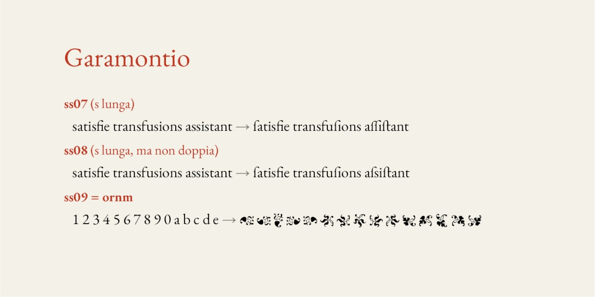

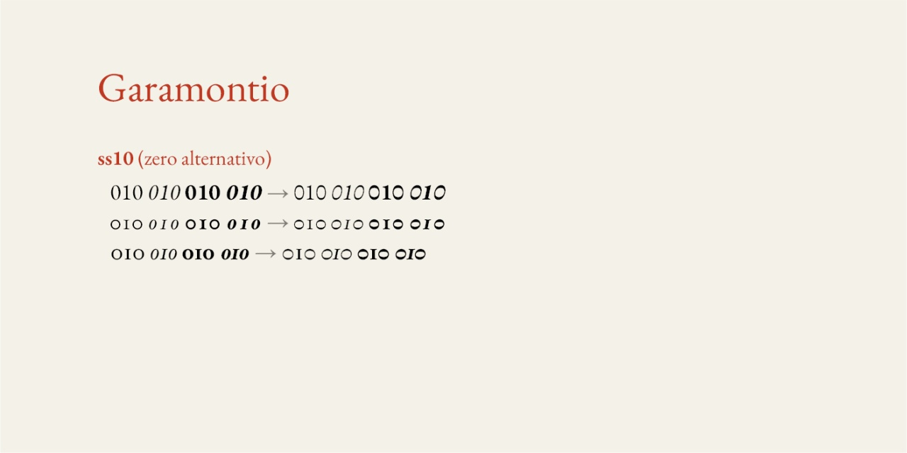

* __cv01__ : versione alternativa delle lettere greche per IPA
* __cv02__ : versione alternativa di un punto esclamativo (uni2E54)
* __cv03__ : legature /AE /OE /ae /oe
* __cv04__ : posizione alternativa degli accenti per le lettere /b /d /h /k
* __cv05__ : versione alternativa per le manicule come da [esemplare disponibile online](https://sammlungen.ub.uni-frankfurt.de/drucke/content/zoom/7499396)
* __cv06__ : versione alternativa di e commerciale (&) (solo corsivo)
* __cv07__ : versione alternativa (SS/ss) per __ẞ__ e __ß__
* __cv08__ : versione alternativa del numero 1 per __onum__ e __onum&pnum__
* __cv09__ : numeri romani
* __cv10__ : numeri romani maiuscoletto
* __cv11__ : segno di paragrafo alternativo
* __cv12__ : segni /ordfeminine ª /ordmasculine º /numero №
* __cv13__ : versione alternativa di /endash e /emdash
* __cv14__ : f corta
* __cv21__ : [Block Elements](https://it.wikipedia.org/wiki/Block_Elements)
* __cv22__ : bordi
* __cv23__ : numeri cerchiati da 0 a 99
* __cv24__ : numeri in cerchio pieno da 0 a 99
* __cv25__ : frecce cerchiate e in cerchio pieno
* __cv28__ : versione alternativa per /Hbar
* __cv31__ : cirillico Serbo/Macedone
* __cv51__ : legature per /f con /i
* __cv99__ : logo da /@

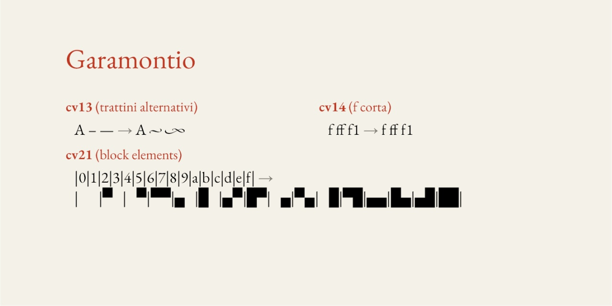

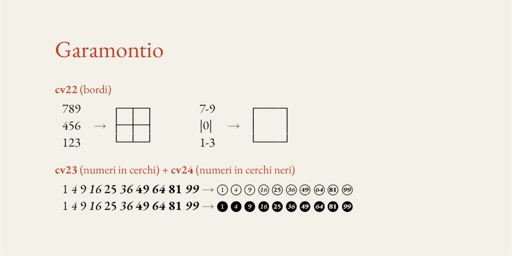

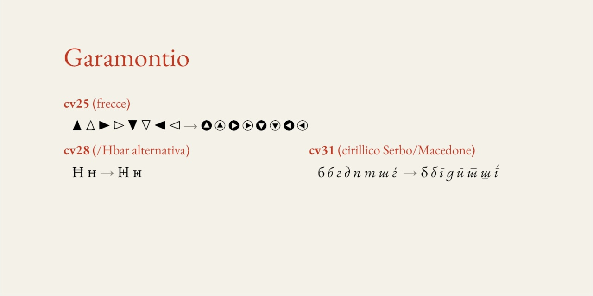

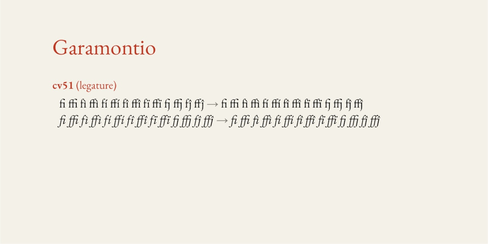

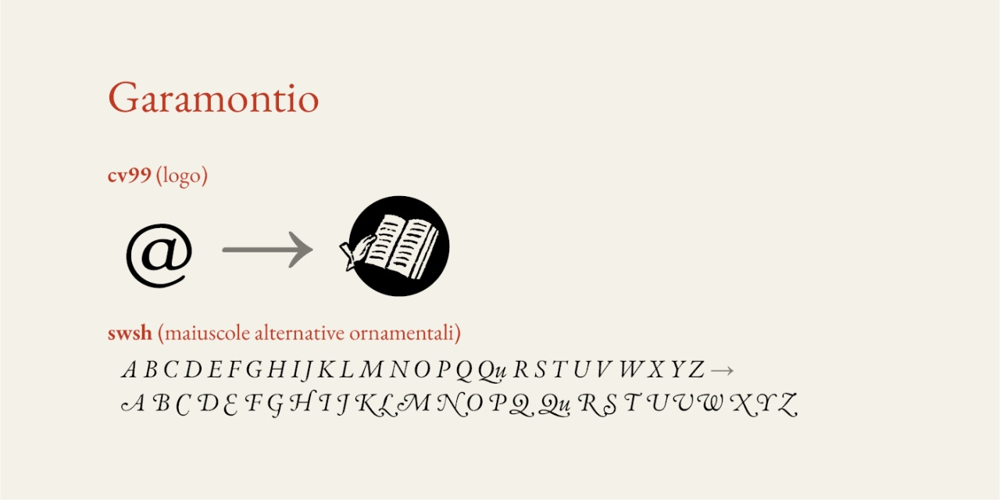

Le caratteristiche opentype sono facilmente attivabili in LibreOffice ([it](https://help.libreoffice.org/latest/it/text/shared/01/font_features.html) / [en](https://help.libreoffice.org/latest/en-US/text/shared/01/font_features.html))

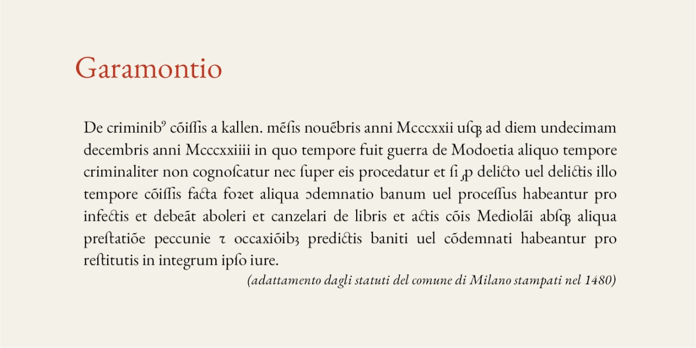

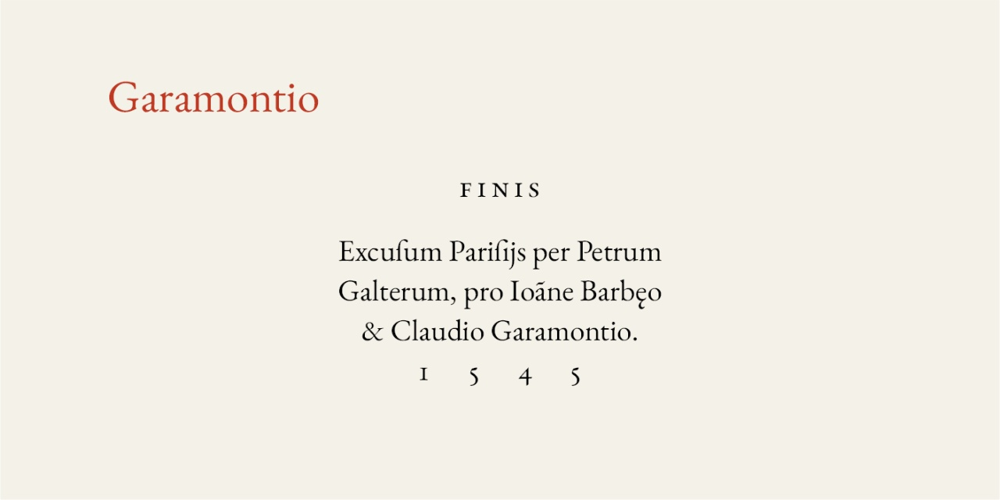

## Garamontio Capo

È disponibile anche il font sperimentale [Garamontio Capo](https://github.com/m-casanova/GaramontioCapo) per ottenere capolettera

Si possono anche utilizzare capolettera cinquecenteschi come [Capo Nodi](https://github.com/m-casanova/CapoNodi)

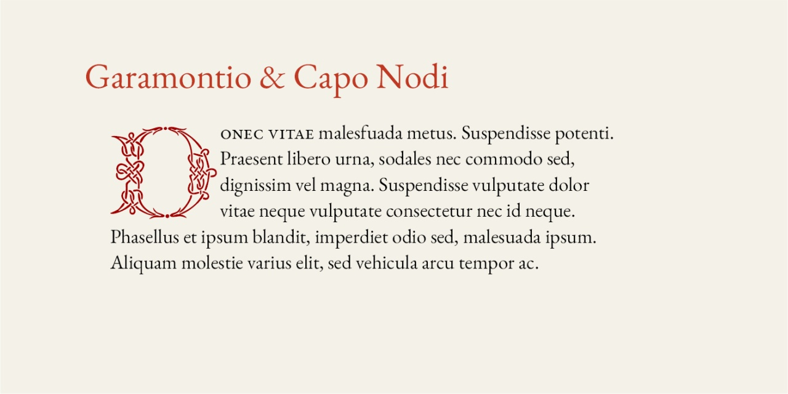

## Versioni
- Versione 1.055: aggiunta caratteri per __ss04__ (esperimento corsivo aldino)
- Versione 1.054: fix minori e aggiunta di alcuni caratteri
- Versione 1.053: aggiunta di alcuni [simboli musicali da blocco uni1D100](https://en.wikipedia.org/wiki/Musical_Symbols_(Unicode_block))
- Versione 1.052: fix minori e aggiunta di alcuni caratteri
- Versione 1.051: fix per /f con /imacron e /idblgrave (con legature per __cv51__)
- Versione 1.050: aggiunta __cv51__ per legature di /f e /i
- Versione 1.049: fix minori
- Versione 1.048: fix crenatura per lettera /R con alcune lettere seguenti + test __cv99__ per logo
- Versione 1.047: fix crenatura per lettera /R con alcune lettere seguenti
- Versione 1.046: aggiunta __cv25__ per frecce cerchiate e in cerchio nero
- Versione 1.045: aggiunta __cv24__ per numeri in cerchio nero (da 0 a 99)
- Versione 1.044: aggiunta __cv23__ per numeri in cerchio (da 0 a 99)
- Versione 1.043: aggiunta di alcuni caratteri + passaggio di alcuni elementi da __ssXX__ e __cvXX__
- Versione 1.042: modifiche per _f corta_ contestuale + aggiunta __cv14__
- Versione 1.041: aggiunta __ss12__ per bordi
- Versione 1.040: sistemazione /tildedoublecomb + aggiunta caratteri box sottili (/uni2500 e seguenti)
- Versione 1.039: esperimento per /tildedoublecomb
- Versione 1.038: esperimento per __mgrk__ (caratteri greci per notazione matematica)
- Versione 1.037: ottimizzazione legature /longs
- Versione 1.036: ottimizzazione legature /f
- Versione 1.035: fix minori
- Versione 1.034: fix cirillico
- Versione 1.033: fix crenatura per _Vu_ e fix minori
- Versione 1.032: fix crenatura __smcp__ e __pcap__
- Versione 1.031: sistemazione __smcp__ e __pcap__ per /macroncomb e /brevecomb
- Versione 1.030: aggiunta __cv31__
- Versione 1.029: sistemazione generale per gli elementi "Modifier Letter"
- Versione 1.028: fix minori
- Versione 1.027: aggiunto __cv13__ (varianti /endash /emdash) + fix macron per smallcaps
- Versione 1.026: fix minori
- Versione 1.025: aggiunta __cv12__ + fix minori
- Versione 1.024: correzione problema /u corsivo e aggiunta __ss11__ per [Block Elements](https://it.wikipedia.org/wiki/Block_Elements)
- Versione 1.023: aggiunta di caratteri per menu (☰ /uni2630 e ✕ /uni2715)
- Versione 1.022: aggiunta __cv11__ (simbolo paragrafo)
- Versione 1.021: fix numeri romani (errore per numero 50)
- Versione 1.020: fix minori e test per versione OTF del font
- Versione 1.019: aggiunta di caratteri
- Versione 1.018: nuovo test % per __onum__
- Versione 1.017: endash emdash per __ordn__, __sups__, __subs__, __sinf__ -- test % per onum 
- Versione 1.016: miglioramento coda /Q /Q.medium /Q.long per corsivo
- Versione 1.015: fix minori + icone Creative Commons
- Versione 1.014: aggiunta di alcuni caratteri
- Versione 1.013: fix minori
- Versione 1.012: distinzione __cv09__ e __cv10__ per numeri romani
- Versione 1.011: aggiunta __cv09__ per numeri romani
- Versione 1.010: aggiunta __cv08__ per variante numero 1 (onum, onum&pnum)
- Versione 1.009: fix minori
- Versione 1.008: fix minori
- Versione 1.007: sistemazione maiuscole per __swsh__ (corsivo)
- Versione 1.006: tentativo di rendere più omogenee le maiuscole per __swsh__ (corsivo)
- Versione 1.005: fix problema con accento in maiuscole / rimosso OTF (inutile duplicato TTF)
- Versione 1.004: fix forme per __ss10__ + fix crenatura
- Versione 1.003: fix cifre + __zero__ (slashedzero) + __ss10__ (zero alternativo)
- Versione 1.002: fix minori
- Versione 1.001: fix minori
- Versione 1.000: aggiunta di alcuni caratteri
- Versione 0.973: fix minori
- Versione 0.972: fix larghezza lettera /i per carattere tondo
- Versione 0.971: fix minori
- Versione 0.970: aggiunta /ur (uni1dd1) + aggiunta alcuni ornamenti 
- Versione 0.969: fix minori
- Versione 0.968: fix minori
- Versione 0.967: sistemazione crenatura apostrofo
- Versione 0.966: riorganizzazione caratteristiche __ssXX__ e __cvXX__
- Versione 0.965: fix minori e aggiunta __cv05__ per manicule
- Versione 0.964: fix legature (__liga__, __hlig__, __dlig__)
- Versione 0.963: aggiunta __cv02__ (punto esclamativo) e __cv04__ (esperimento maiuscole in tondo per il corsivo, cfr. Manuzio) 
- Versione 0.962: fix minori
- Versione 0.961: fix posizione dieresi/punto + legature /AE /OE /ae /oe (__cv03__)
- Versione 0.960: <s>alternativa posizione punto /i /j (__cv02__)</s> [Rimosso v. 0.961]
- Versione 0.959: fix minori
- Versione 0.958: fix posizione punto /i /j
- Versione 0.957: fix minori
- Versione 0.956: modificato leggermente il peso delle versioni intermedie
- Versione 0.955: fix minori
- Versione 0.954: maiuscoletto coerente tra regular e italic (fix greco)
- Versione 0.953: fix minori + aggiunta caratteri
- Versione 0.952: aggiunta __cv28__ /Hbar + aggiunta caratteri e simboli matematici + fraktur (__cv01__)
- Versione 0.951: fix minori + aggiunta caratteri + modifica __ss10__
- Versione 0.950: fix minori + aggiunta caratteri + prima crenatura per __pcap__ e __c2pc__
- Versione 0.949: fix minori, incluse alcune ancore per alfabeto cirillico
- Versione 0.948: fix minori + __ss09__ (elementi ornamentali)
- Versione 0.947: fix minori + __ss05__ (Q coda corta) + __ss06__ (Q coda lunga) + __ss08__ (eszet)
- Versione 0.946: aggiunta /copyleft + test per __ss06__ (coda lettera Q)
- Versione 0.944: fix accenti + /longs
- Versione 0.943: fix minori (__dlig__ e crenatura)
- Versione 0.942: aggiunta caratteri __pcap__
- Versione 0.941: fix minori + test __ss04__ (varianti /b /d /h /k)
- Versione 0.940: aggiunta di caratteri per cedilla + test __ss04__ (varianti /h e /k)
- Versione 0.939: aggiunta di caratteri + fix minori
- Versione 0.938: blocco IPA completato + carattere ℗ + fix minori
- Versione 0.937: aggiunta di caratteri e fix minori
- Versione 0.935: sistemazione di caratteri combinati
- Versione 0.934: tentativo di sistemazione delle ancore per i caratteri combinati
- Versione 0.933: aggiunti caratteri musicali, __ss03__ (caratteri greci IPA + corsivo), fix kerning / con punteggiatura
- Versione 0.932: blocco IPA (aggiunte caratteri) e sistemazione per alcuni segni diatrici
- Versione 0.931: blocco IPA (aggiunte caratteri) e sistemazione per alcuni segni diatrici
- Versione 0.929: blocco IPA (aggiunte e correzione forma di alcuni caratteri), correzione ę
- Versione 0.928: blocco IPA (aggiunte e correzione forma di alcuni caratteri)
- Versione 0.927: blocco IPA (aggiunte)
- Versione 0.926: fix per caratteri combinati (continuazione)
- Versione 0.925: fix per caratteri combinati (non ancora completato)
- Versione 0.924: fix minori
- Versione 0.923: fix minore e aggiunta carattere F160 da MUFI
- Versione 0.922: tentativo di sistemazione di /f.short per alcuni casi
- Versione 0.921: sistemazione problemi di interpolazione di alcuni caratteri (regular + italic)
- Versione 0.919: sistemazione disegno dei caratteri
- Versione 0.918: sistemazione della crenatura per diversi caratteri
- Versione 0.917: sistemazione __dlig__ e alcuni fix ai caratteri
- Versione 0.916: aggiunta di alcuni caratteri per trascrizioni come da progetto [MUFI](https://en.wikipedia.org/wiki/Medieval_Unicode_Font_Initiative)
- Versione 0.915: aggiunta di alcuni caratteri per trascrizioni come da progetto MUFI
- Versione 0.911: fix minori e creazione file per versioni statiche del font (otf, ttf, woff, woff2)
- Versione 0.906: modifiche minime per compatibilità con [Garamontio Sans](https://github.com/m-casanova/GaramontioSans)
- Versione 0.905: fix frazioni
- Versione 0.904: versione di prova con miglioramento delle classi e sistemazione di alcuni riferimenti
